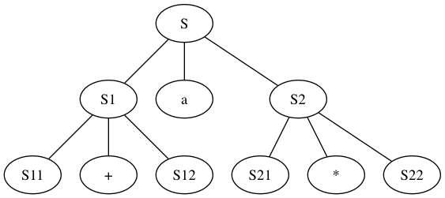

## 2.2.1
1)
``` 
    s -> s s *
        -> s a *
         -> aa + a*
```


2) graphviz 节点名不能重复, sad



3) 只支持自身 ```+``` ```*``` 运算的语言

## 2.2.2 
1) ```0 1 0 1..... (0 1)序列必须出现一次```
2) ```a + a | a - a | ... ```


## 2.2.4 
1) 
```
expr ->  expr expr op | digit
digit -> [0 - 9]*
```
    
2)
```
list -> list , id | id 
```

3)
```
list -> id, list | id
```

4)
```
expr ->  expr + term | expr - term | term 
term -> term * unary | term / unary | unary 

unary -> + factor | - factor | factor

factor -> id | num | (expr)
```

## 2.2.5
1) $$S_{n} = 2^{n} * 3  |  2^{n} * 9 | 2^{(n + 1)}  * 3 | 2 ^ {n} * 15 $$
2) 常数都是3的倍数， 所以能够被3整除

## 2.2.6

1. 罗马数字编码为阿拉伯数字
```
I -> 1
X -> 10
C -> 100 
M -> 1000
V -> 5 
L -> 50 
D -> 500 
```

2. 理解文法

    1. 相同的数字连写， 所表示这些数字相加得到的数, ```II = 2 ```
    2. 小的数字在大的数字右边， 所表示的数等于数字相加得到的数 ```VI = 6```
    3. 小的数字在大的数字左边， 所表示的数等于大数减小数得到的数， ```IV  = 4 ```

3. 文法

    1. smallDigit -> I | II | III | ε
    2. digit -> smallDigit | I V | V smallDigit | I X
    3. smallTen -> X | XX | XXX
    4. ten -> smallTen | X L  | L smallTen | X C
    5. smallHundred -> C | CC | CCC
    6. hundred -> smallHundred | C D | D smallHundred | C M 
    7. thousand -> M | MM | MMM | ε
    8. romanNum -> thousand hundred ten digit

## 2.3.1
```
expr -> {print("+")} expr + term
      | {print("-")} expr - term
      | term 

term -> print("*")  term * factor
      | print("/")  term / factor
      | factor

factor -> num | (expr)
```

## 2.3.2


```
9 5 - 2 *

E -> {print("(")} E {print(op)} E {print(")"}} op | digit {print(digit)}
```

## 2.3.3
```
num -> thousand hundred ten digit
       { num.roman = thousand.roman || hundred.roman || ten.roman || digit.roman;
         print(num.roman)}

thousand -> low {thousand.roman = repeat('M', low.v)}

hundred -> low {hundred.roman = repeat('C', low.v)}
         | 4 {hundred.roman = 'CD'}
         | high {hundred.roman = 'D' || repeat('X', high.v - 5)}
         | 9 {hundred.roman = 'CM'}

ten -> low {ten.roman = repeat('X', low.v)}
     | 4 {ten.roman = 'XL'}
     | high {ten.roman = 'L' || repeat('X', high.v - 5)}
     | 9 {ten.roman = 'XC'}

digit -> low {digit.roman = repeat('I', low.v)}
       | 4 {digit.roman = 'IV'}
       | high {digit.roman = 'V' || repeat('I', high.v - 5)}
       | 9 {digit.roman = 'IX'}

low -> 0 {low.v = 0}
     | 1 {low.v = 1}
     | 2 {low.v = 2}
     | 3 {low.v = 3}

high -> 5 {high.v = 5}
      | 6 {high.v = 6}
      | 7 {high.v = 7}
      | 8 {high.v = 8}
    


```

## 2.3.4
```

romanNum -> thousand hundred ten digit {romanNum.v = thousand.v || hundred.v || ten.v || digit.v; print(romanNun.v)}
thousand -> M {thousand.v = 1}
          | MM {thousand.v = 2}
          | MMM {thousand.v = 3}
          | ε {thousand.v = 0}
hundred -> smallHundred {hundred.v = smallHundred.v}
         | C D {hundred.v = smallHundred.v}
         | D smallHundred {hundred.v = 5 + smallHundred.v}
         | C M {hundred.v = 9}
smallHundred -> C {smallHundred.v = 1}
              | CC {smallHundred.v = 2}
              | CCC {smallHundred.v = 3}
              | ε {hundred.v = 0}
ten -> smallTen {ten.v = smallTen.v}
     | X L  {ten.v = 4}
     | L smallTen  {ten.v = 5 + smallTen.v}
     | X C  {ten.v = 9}
smallTen -> X {smallTen.v = 1}
          | XX {smallTen.v = 2}
          | XXX {smallTen.v = 3}
          | ε {smallTen.v = 0}
digit -> smallDigit {digit.v = smallDigit.v}
       | I V  {digit.v = 4}
       | V smallDigit  {digit.v = 5 + smallDigit.v}
       | I X  {digit.v = 9}
 smallDigit -> I {smallDigit.v = 1}
            | II {smallDigit.v = 2}
            | III {smallDigit.v = 3}
            | ε {smallDigit.v = 0}
```

## 2.3.5
```
92+3- => -+923

expr -> {print(op)} expr expr op | digit {print(digit)}
```

## 2.6.1
1)

```java
if (peek == '/') {
      char nextLetter = (char) System.in.read();

      /*
       1. 判断是否是否以 // 开头
       2. 如果是的则丢弃这行内容
      */

      if (nextLetter == '/') {
        do {
          nextLetter = (char) System.in.read();
        } while (nextLetter != '\n');

        peek = ' ';
      }

      /*
        1. 判断是否以 /* 开头, 结尾
        2. 如果是的则丢弃这段内容
      */

      if (nextLetter == '*') {
        char nextCharLetter = ' ';
        do {
          nextLetter = (char) System.in.read();
          nextCharLetter = (char) System.in.read();
        } while (nextLetter != '*' && nextCharLetter != '/');
      }
}
```

## 2.6.2
```java
if (peek == '<' || peek == '=' || peek == '!' || peek == '>') {
      char nextCharLetter = (char) System.in.read();

      if (nextCharLetter == '=') {
        peek = ' ';
        return new Opeartor(Tag.OPERATOR, "" + peek + nextCharLetter);
      } else {
        peek = nextCharLetter;
        return new Opeartor(Tag.OPERATOR, "" + peek);
      }
}
```

## 2.6.3
```java

```


