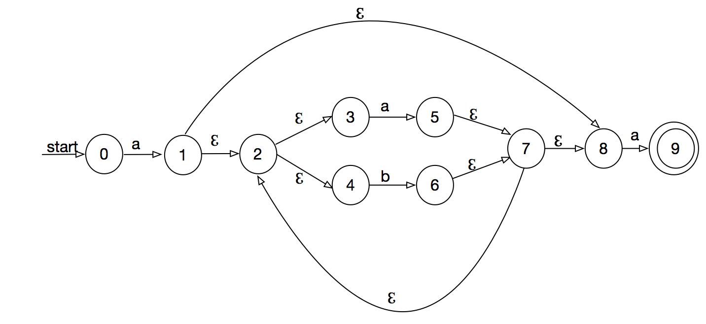
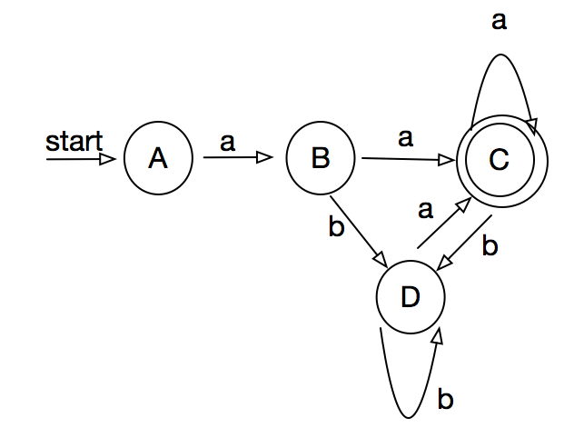
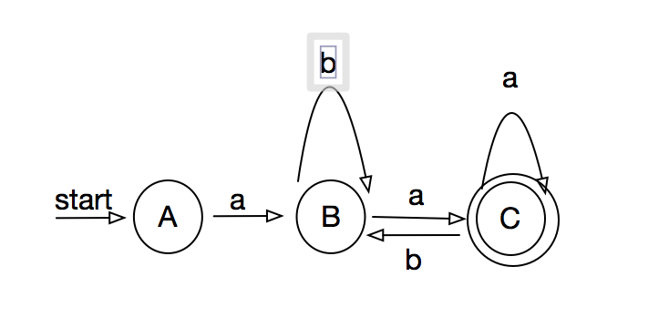

## 3.3.2

1)

```
a(a|b)*a = {aa*a, ab*a }
```

2) 

```
((ℨ|a)b*)* = {ℨ, (ab*)*, b*}
```

3)

```
(a|b)*a(a|b)(a|b) = {
    a*a(a|b)(a|b),
    a*(a|b),
    a*b(a|b),
    a*,
    a*b,
    a*b,
    a*bb,
    b*a(a|b)(a|b),
    b*aa(a|b),
    a*aaa,
    b*aaab,
    b*ab(a|b),
    b*aba,
    b*abb
}
```

## 3.3.3
1) n + 1 
2) n + 1
3) n - 1
4) (n + 1) * n / 2
5) n ^ 2

## 3.3.4
```
select -> [Ss][Ee][Ll][Ee][Cc][Tt]
```

## 3.4

### 1. a(a|b)*a

NFA: 

DFA:

|state|a|b|
|----|----|----|
|{0}|{1}| |
|{1}|{2, 3, 4, 5, 7, 8, 9}|{2, 3, 5, 6, 7, 8}|
|{2, 3, 4, 5, 7, 8, 9}|{2,3,4,5,6,7,8,9}|{2, 3, 5, 6, 7, 8}|
|{2, 3, 5, 6, 7, 8}|{2,3,4,5,6,7,8,9}|{2, 3, 5, 6, 7, 8}|

设
- {0} = A
- {1} = B
- {2, 3, 4, 5, 7, 8, 9} = C
- {2, 3, 5, 6, 7, 8} = D  




合并不可区分状态B, D 




## 3.4.3
1) abababaab

|s|1|2|3|4|5|6|7|8|9|
|----|----|----|----|---|----|----|----|-----|
|f(s)|0|0|1|2|3|4|5|1|2|

## 3.5

while {return(WHILE)}

2) 


