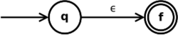

# NFA
NFA可以在给定输入符号上从给定状态进行零，一或多个移动。NFA也可以具有NULL移动（没有输入符号的移动）。另一方面，DFA在给定的输入符号上从给定状态只有一个动作。

举例来讲解下如何将一个nfa转换为dfa


比如有下面的NFA 


|State|a|b|
|----|----|----|
|q0|q0,q1|q0|
|q1| |q2|
|q2| | |


转换步骤:

1. 设DFA的状态集合为Q'  Q' = {q0}
2. 对于Q’中的每个状态，找到每个输入符号的状态。当前，Q’中的状态为q0，使用NFA的转换函数在输入符号a和b上从q0查找移动，并更新DFA的转换表。

|state|a|b|
|----|----|---|
|q0|{q0,q1}|q0|

因为{q0, q1}不在Q', Q' = {q0, {q0, q1}}


3. 现在，在DFA转换表中不存在来自状态{q0，q1}的不同输入符号上的移动，我们将按照以下方式进行计算：

|state|a|b|
|----|----|----|
|q0|{q0,q1}|q0|
|{q0, q1}|{q0,q1}|{q0, q2}|

因为{q0, q2} 不在Q' 里面， 所以Q' = {q0, {q0, q1}, {q0, q2}}

|state|a|b|
|----|----|----|
|q0|{q0,q1}|q0|
|{q0, q1}|{q0, q1}|{q0, q2}|
|{q0, q2}|{q0, q1}|{q0}|


所以最后Q' = {q0, {q0, q1}, {q0, q2}}


## Thompson构造法
Thompson构造法在计算机科学中是指一个能将正则表达式转化为一个与之等价的非确定有限状态自动机（NFA）的算法。算法得到的NFA可以在编程中用于匹配一个正则表达式，这也是正则表达式引擎实现的基本思路之一。

Thompson 算法中使用最基本的两种转换:

1. 不需要输入转换成另外一个状态


2. 输入一个值转换成另外一个状态


正则表达式的各种运算， 可以通过上述两种转换实现:

- 组合运算```RS```:  


- 替换运算```R|S```: 


- 重复运算```R*```:  


