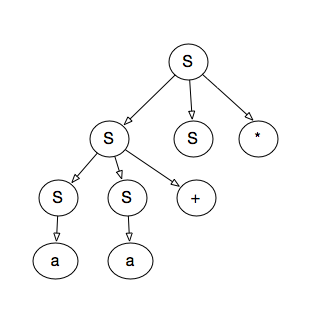

# 4.2.1

1)  

```
S = lm => SS* => SS+S* => as+s* => aa+s* => aa+a*
```

2) 

```
s = rm => SS* => sa* => ss+a* => sa+a* => aa+a*
```
       
3)



4) 否


5) L = {11+}

## 4.2.2

1) 

```
S -> 0 S 1 | 0 1  和串000111
```

```
S = lm => 0 S 1  => 0 0 S 1 1 => 0 0 0 1 1 1 
S = rm => 0 S 1  => 0 0 S 1 1 => 0 0 0 1 1 1 
```
2)

```
S -> + S S | * S S | a 和串 + *aaa
```

```
S = lm = + S S = + * S S S = + * a S S  = +*aaa 
S = rm = + S S = + S a = + * S S a = + * S a a = +*aaa 
```

3) 
```
S -> S (S) S -> | ℇ 和串(()())
```

```
S = lm => S (S) S => ℇ (S) S => ℇ (S (S) S) S => (S (S) S (S) S) S => 
    (ℇ (S) s (S) S) => ... => (()())

S = rm => S (S) S => S (S) ℇ => S (S (S) S) => S (S (S) S (S) S) => 
 ... => (()())

```


## 4.2.3
1)
所有由0和1组合成的串， 并且每个0后面至少跟着1个1


```
S -> (0?1)*
```

2)
```
S -> 0S0 | 1S1 | 0 | 1 | ε
```

3)
```
S -> 0S1S | 1S0S | ε
```

4)
```
S -> 01S | 1S0 | 1 | 0
```

5)
不包含011
```
S -> 1*(0+1?)*
```

## 4.2.5
```
stmt -> if expr then stmt [else stmt]
        | begin stmtlist end 

stmtlist -> stmt [; stmtList]
```

## 4.4.1
### S -> 0 S 1 | 0 1

1. 提取左公因子
    
    S -> 0A
    A -> S 1 | 1 


2. 消除左递归
    
    S -> 0A 
    A -> 0 A 1 | 1 

3. 预测分析表
    
|非终结符号|0|1|$|
|----|----|----|----|
|S|S -> 0A| | |
|A|A -> 0 A 1|A -> 1| |


### S -> + S S | * S S | a 
1. 无左公因子

2. 无左递归

|非终结符号|+|* |a|$|
|----|----|----|----|----|
|S|S -> + S S | S -> * S S | S -> a | |


### S -> S (S) S | ℇ

1. 无左公因子

2. 消除左递归
```
    S -> A

    A -> (S) S A | ℇ
```

3. 预测分析表

|非终结符号|( | ) |$|
|----|----|----|----|
|S|S->A| S->A| S->A|
|A|A -> (S) S A <br> A -> ℇ |A -> ℇ| A -> ℇ|


### S -> S + S | S S | ( S ) | S* | a 

1. 提取左公因子
```
    S -> SA | (S) | a
    A -> +S |  S  |  * 

=>
    S -> SA |  T 
    A -> +S |  S  |  * 
    T -> (S) | a 

```

2. 消除左递归
```

i = 1
    S -> TB
    B -> AB | ε

i = 2
 j = 1 
    A -> + S | TB | * 

i = 3
 j = 1 
    无需处理
 j = 2
    无需处理

最终得到的产生式：
    S -> TB
    B -> AB | ε
    A -> + S | TB | *
    T -> (S) | a
```

3. 预测表
```
FIRST(S) = FIRST(T) = { (, a }

FIRST(B) = {FIRST(A), ε}  = { + , (, a, *, ε }

FIRST(A) = {+ , first(T), *} = {+, (, a, *}

FIRST(T) = { (, a }


FOLLOW(T) = {$ FIRST(B)} = {$ , + , (, a, *}

FOLLOW(A) = {$ | FIRST(B) | FOLLOW(S)} = {$ , + , (,  a, *, )}

FOLLOW(B) = {$}

FOLLOW(S) = {FOLLOW(A) =  {$ , + , (,  a, *, )}
```

(A->TB 存在ε)

|非终结符号| + | * | ( | ) | a | $ |
|----|----|----|----|----|----|----|
|S|  | | S->TB | | S->TB| |
|B| B->AB | B->AB| B->AB | | B->AB| B->ε|
|A| A->+S | A->*| A->TB| | A->TB||
|T| | | T->(S)| | T-> a | |


### 4.4.2

### 4.4.5


```
S -> aSa | aa 

=> 

   S -> aB
   B -> Sa | a 
   C -> aC | ε
```


