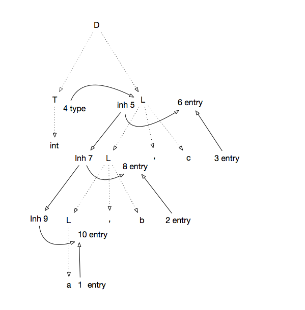
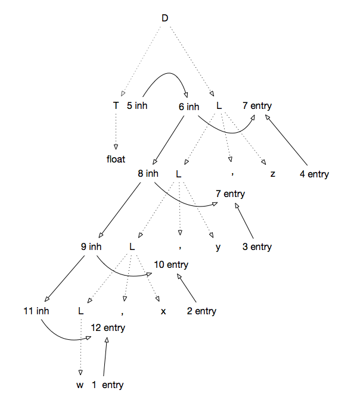

# 习题答案


## 5.2.2





## 5.2.4

```
S -> L . L | L 
L -> L  B  | B
B -> 0 | 1 
```

s
|产生式|语义规则|
|----|----|
|S->L1.L2|L1.isLeft = true<br>L2.isLeft=false<br>S.val = L1.val + L2.val|
|S->L|L.isLeft = true<br>S.val = L.val|
|L1->L2B|L1.isLeft=true<br>L1.len + 1<br>L1.val = L1.isLeft ? L2.val * 2 + B.val : L1.val + B.val * 2 ^(-L.len)
|L->B|L.len = 1 <br> L.val = L.isLeft ? B.val : B.val / 2|
|B->0|B.val = 0|
|B->1|B.val = 1|

其中:

- isLeft为继承属性， 表示节点是否在小数点的左边
- len为综合属性， 表示节点包含的二进制串的长度
- val为综合属性

## 5.2.5

|产生式|语义规则|
|----|----|
|S->L_1.L_2|S.val = L_1.val + L_2.val / L_2.f|
|S->L|S.val = L.val |
|L->L1B|L.val = L_1.val * 2 + B.val <br> L.f = L_1.f * 2|
|L->B|L.val = B.val <br> L.f = 2|
|B->0|B.val = 0 |
|B->1|B.val = 1 |


## 5.3.1

1) 
|产生式|语义规则|
|----|----|
|E -> E_1 + T|E.type = E_1.type == float\|\|T.type == float ? float : int| 
|E -> T |E.type = T.type|
|T -> num1.num2 |T.type = float
|T -> num | T.type = int|

2)
- wrapped: 表达式最外层是否有括号
- procedence: 令+, \*, ()和单digit的优先级分别为0, 1,  2, 4。 如果表达式最外层有括号， 则为去掉括号后最后被计算的运算符的优先级， 否则为表达式最后被计算的运算符的优先级.
- expr: 表达式
- cleanExpr: 去除了冗余括号的表达式。

| |产生式|语法规则|
|:----:|:----:|:----:|
|1)|L -> En| L.cleanExpr = E.wrapped ? E.cleanExpr : E.expr|
|2)|E -> E_1 + T | E.wrapped = false <br> E.precedence = 0 <br> E.expr = E_1.expr \|\| " + " \|\| T.expr <br>E.cleanExpr = (E_1.wrapped ? E_1.cleanExpr : E_1.expr) \|\| (T.wrapped ? T.cleanExpr : T.expr)
|3)|E -> T| E.wrapped = T.wrapped <br> E.precedence = T.precedence <br> E.expr = T.expr <br> E.cleanExpr = T.cleanExpr|
|4)|T -> T_1 * F |T.wrapped = false <br> T.precedence = 1 <br> T.expr = T_1.expr \|\| "*" \|\| F.expr <br> T.cleanExpr = (T_1.wrapped && T_1.precedence >= 1 ? T_1.cleanExpr : T_1.expr) \|\| * \|\| (F.wrapped && F.precedence >= 1 ? F.cleanExpr : F.expr)|
|5)|T -> F |E.wrapped = T.wrapped <br> E.precedence = T.precedence <br> E.expr = T.expr <br> E.cleanExpr = T.cleanExpr|
|6)|F -> (E)|F.wrapped = true<br>F.precedence = E.precedence<br>F.expr = "(" \|\| E.expr \|\| ")"<br>F.cleanExpr = E.expr|
|7)|F->digit|F.wrapped = false<br>F.precedence=3<br>F.expr=digit<br>F.cleanExpr=digit|


