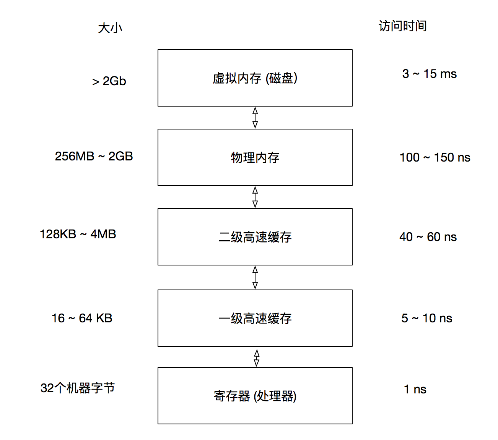

# 运行时刻环境

数据对象的存储布局受目标机的寻址约束的影响很大。 在很多机器上， 执行整数加法的指令可能要求整数是对齐的， 也就是说这些数必须被放在一个能够被4整除的地址上。比如一个10个字符的数组，但是编译器可能为了对齐而给它分配12个字节， 其中的两个字节未使用， 因为对齐的原因而产生的闲置时间称为**补白**。

静态存储:  编译器只需要观察程序文本即可做出某个存储分配决定， 而不需要观察该程序在运行时做出了什么， 我们就认为这个存储分配决定时静态的。
动态存储:  只有在程序运行时才能做出决定， 那么这个决定就是动态的。

很多编译器使用下列两种策略的某种组合进行动态存储分配:
- 栈式存储。 一个过程的局部名字在栈中分配空间。 
- 堆式存储。 有些数据的生命周期要比创造它的某次过程调用更长， 这些数据通常被分配在一个可复用存储的"堆"中。

**活动树:** 用一棵树来表示在整个程序运行期间的所有过程活动

活动树和程序行为之间存在下列多种有用的对应关系， 正是因为这些关系使我们可以使用运行时刻栈：

1） 过程调用的序列和活动树的前序遍历相对应
2） 过程返回的序列和活动树的后续遍历相对应

## 调用代码序列

实现过程调用的代码称为调用代码序列. 这个代码序列为一个活动记录在栈中分配空间， 并在此记录的字段中填写信息， 返回代码序列是一段类似的代码， 它恢复机器状态， 使得调用过程能够在调用结束之后继续执行。

## 访问链
针对嵌套函数的通常的静态作用域规则的一个直接实现方法是在每个活动记录中增加一个被称为访问链的指针。

## 存储管理器
现代计算器都以存储层次结构的方式安排它们的存储， 如图所示

较小较快的元素"更加接近"处理器， 较大较慢的元素则离存储器比较远, 在一次内存访问中， 机器首先在最近的存储中寻找数据， 如果数据不在哪里则到上一层中寻找， 以此类推。

1. 数据以连续块的方式进行传输。 为了分摊访问的开销， 内存层次结构中较慢的层次通常使用较大的块， 在主存和高速缓存之间的数据是按照被称为高速缓存线的块进行传输。 在虚拟内存(磁盘)和主内存之间的数据是以被称为"页"的内存块进行传输的， 页的大小通常在4 - 64kb之间。

应对存储管理的规范：

1. 当对象的生命周期能够被静态推导出来时候， 可以使用*对象所有者*的概念, 所有者是指向这个对象的一个指针， 所有者负责删除这个对象或者把这个对象传递给另一个所有者.
2. 当对象的生命周期需要动态确定时候， 引用计数会有所帮助, 它的基本思想是给每个动态分配的对象附上一个计数， 在指向这个对象的引用或被创建时， 我们将此对象的引用计数加一， 当一个引用被删除时， 我们将此引用计数减一。 当计数变成0时， 这个对象就不会再被引用， 因此可以被删除.
3. 对于其生命周期局限于计算过程中的某个特定阶段的一组对象， 可以使用基于区域的分配方法， 也就是内存池。

### 引用计数垃圾回收器
引用计数可以按照下面的方法进行维护:
1. 对象分配。 新对象的引用计数被设置为1
2. 参数传递。 被传递给一个过程的每个对象的引用计数加一.
3. 引用赋值。 如果u和v都是引用， 对于语句u = v， v指向的对象的引用计数加一， u本来指向的原对象的引用计数减一
4. 过程返回。 当一个过程退出时， 该过程记录的局部变量所指向的对象的引用必须减一。
5. 可达性的传递丢失， 当一个对象的引用计数变成0时， 我们必须将该对象中的各个引用所指向的每个对象的引用计数减1。

引用计数的缺点：
1. 它不能回收不可达的循环数据结构， 并且它的开销较大。

优势：
1. 在于垃圾回收是以增量方式完成的。